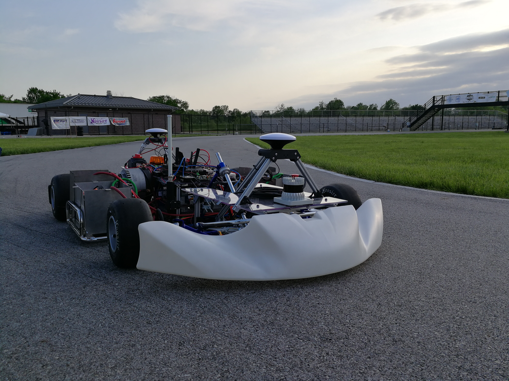

GoKart - Build Documentation
================================================

Welcome to the official build documentation of UPenn GoKart.

.. note:: UPenn GoKart is an open source project developed by a community of
          researchers and students. The documentation team can always use your
          feedback and help to improve. If
          you don't understand something, or cannot find what you
          are looking for in the docs, help us make the documentation better
          by letting us know!

          Submit an issue `GitHub repository <https://github.com/mlab-upenn/gokart-doc>`_.

The table of contents in the sidebar should let you easily access the
documentation for your topic of interest. You can also use the search function
in the top left corner.

.. toctree::
   :maxdepth: 1
   :caption: Build
   :name: sec-getting-started
   :hidden:

   intro
   build_car/index

.. toctree::
   :maxdepth: 1
   :caption: Simulate
   :name: sec-forward
   :hidden:

   simulator/main
..
   going_forward/drive_rosbag
   going_forward/simulation/index
   going_forward/algorithms/index

.. toctree::
   :maxdepth: 2
   :caption: Learn
   :name: sec-learn
   :hidden:

   learn/intro

.. toctree::
    :maxdepth: 2
    :caption: Race and Team
    :name: sec-team
    :hidden:

    race_and_team/intro

.. toctree::
   :maxdepth: 1
   :caption: Support
   :name: sec-support-contact
   :hidden:

   getting_started/faq
   support/contact
   support/acknowledgment

.. Indices and tables
.. ------------------
..
.. * :ref:`genindex`
.. * :ref:`modindex`
.. * :ref:`search`
