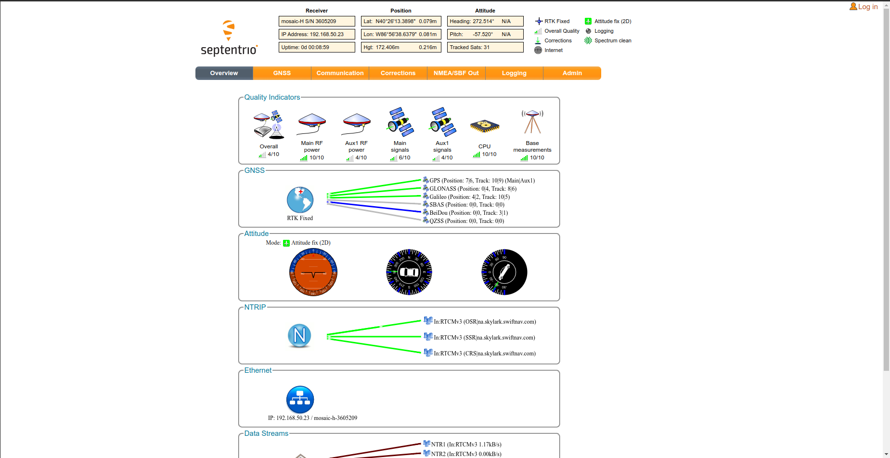

.. _doc_gnss:

GNSS
=========================

Global navigation satellite system (GNSS) is the system used for obtaining the current position. We use the Sepntrio `Mosaic-H dev kit <https://shop.septentrio.com/en/shop/mosaic-h-gnss-heading-module-development-kit-2-gnss-antennae?utm_medium=website&utm_source=GNSS%20receivers%20or%20modules%20%20Page%20mosaic-H%20-%20CTA%20to%20webshop>`_
The dual antenna setup improves functionality as we also obtain heading (`True North heading <https://airplaneacademy.com/whats-the-difference-between-true-and-magnetic-heading-explained/#:~:text=True%20heading%20is%20your%20direction,being%20hundreds%20of%20miles%20apart.>`_) from the system.

Resources:
    * `Mosaic Hardware Manual <https://www.septentrio.com/system/files/support/mosaic_hardware_manual_v1.5.0.pdf>`_
    * `Mosaic-H reference guide <https://www.septentrio.com/system/files/support/mosaic-h_firmware_v4.9.1_reference_guide.pdf>`_

The Septentrio board has a web poretal to set parameters and visulaize incoming data. This portal also shows current GNSS working with important metrics.
The figure below shows a screenshot of this portal captured in Purdue. As we can see it shows the current location and heading. Along with that it also shows the number of satellites being tracked, the correction data status, wheter the board is connected to internet, etc.
One important parameter that helped us with debugging is the antenna RF power and signal strength. Based on these parameters we ordered new :ref:`ref-antenna`.

.. _ref-antenna:

=========================
Antenna
=========================
We used 2 `GNSS Multi-Band L1/L2 Surveying <https://www.sparkfun.com/products/17751>`_ antenna.

=========================
RTK correction services
=========================

    1. Point One Polaris-
        * https://pointonenav.com/polaris
        * https://github.com/PointOneNav/polaris

    2. u-blox PointPerfect
        * SSR, i.e. PPP-RTK
        * https://portal.thingstream.io/pricing
        * 3-6 cm, < 30 s
        * SPARTN format, not supported by Septentrio mosaic-H
        * Supported natively only by u-blox receivers with an up-to-date firmware (and maybe only on the latest revisions)
        * https://www.u-blox.com/en/technologies/ppp-rtk-gnss-correction-services-pointperfect
        * http://rtcm-ntrip.org/home.html
        * free, but only a few available

    3. RTK2GO
        * http://rtk2go.com/
        * 'RTK2GO public base stations map <https://www.google.com/maps/d/u/0/edit?mid=1IMrStJfvUROGhlZtQzr1fDgeN-hBom6i&usp=sharing>'_
        * 'RTK2GO public base stations <https://docs.google.com/spreadsheets/d/19LGGK_gizAD02vjECt7P1b4enX6-dsjAkxU3BNMIU9Q/edit?usp=sharing>'_

    4. Skylark
        * $49 per month per client
        *  https://www.swiftnav.com/skylark
        * Coverage in US
        * RTCM over NTRIP

    5. Trimble RTX
        *  https://positioningservices.trimble.com/services/rtx/
        * $400 per year

    6. RTK service in Indiana
        * https://incors.in.gov/rtk.aspx

    7. KeyNet
        * RTK service in PA, works in Philly
        * http://www.keynetgps.com/
        * $375 for 30 days; $3135 annually

=========================
RTK basestation
=========================
    * https://learn.sparkfun.com/tutorials/how-to-build-a-diy-gnss-reference-station/all
    * https://learn.sparkfun.com/tutorials/setting-up-a-rover-base-rtk-system
    * https://learn.sparkfun.com/tutorials/gps-rtk2-hookup-guide
