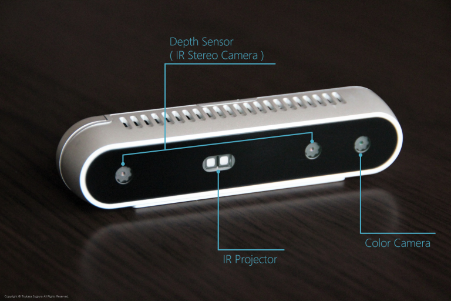
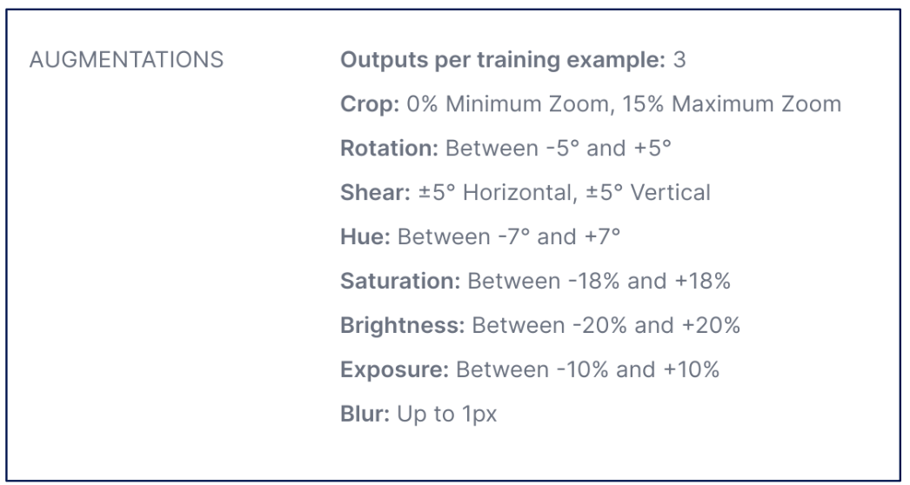
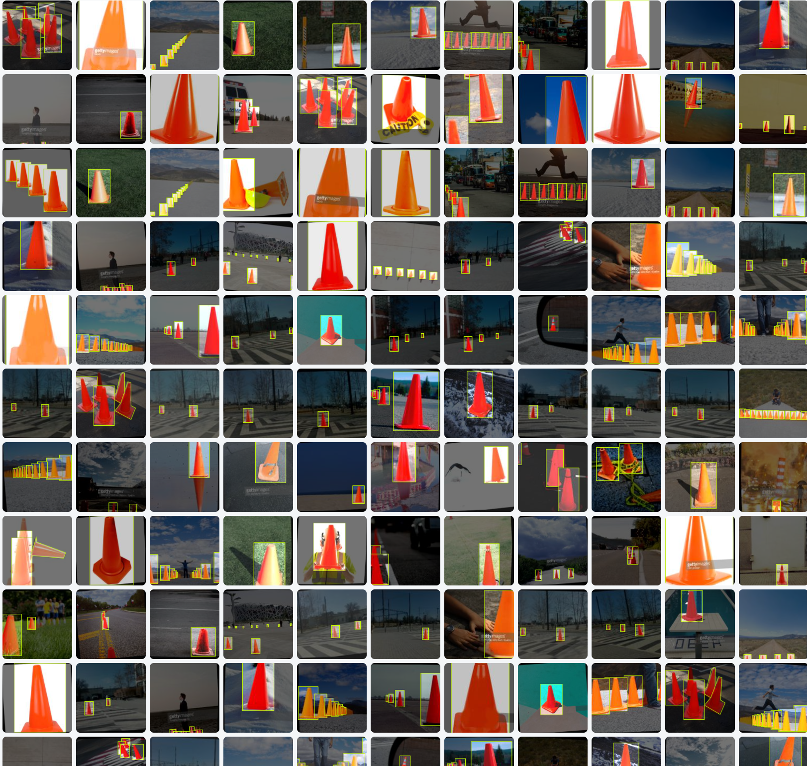
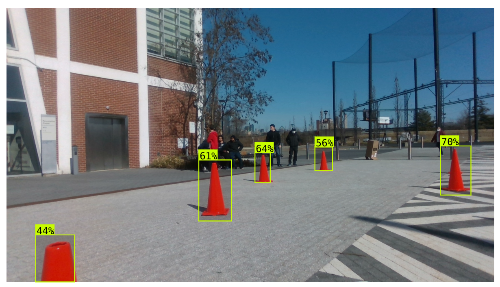
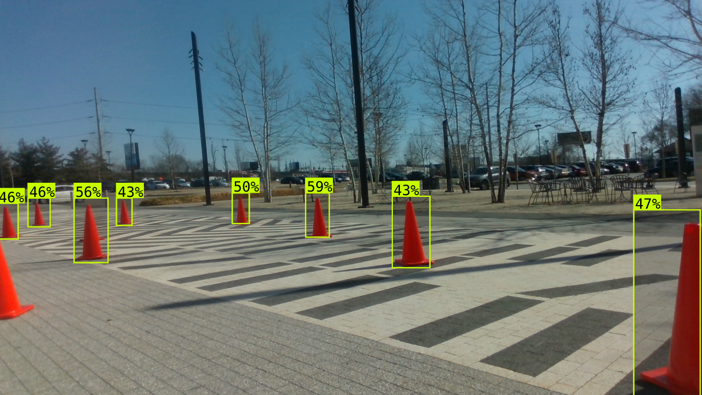
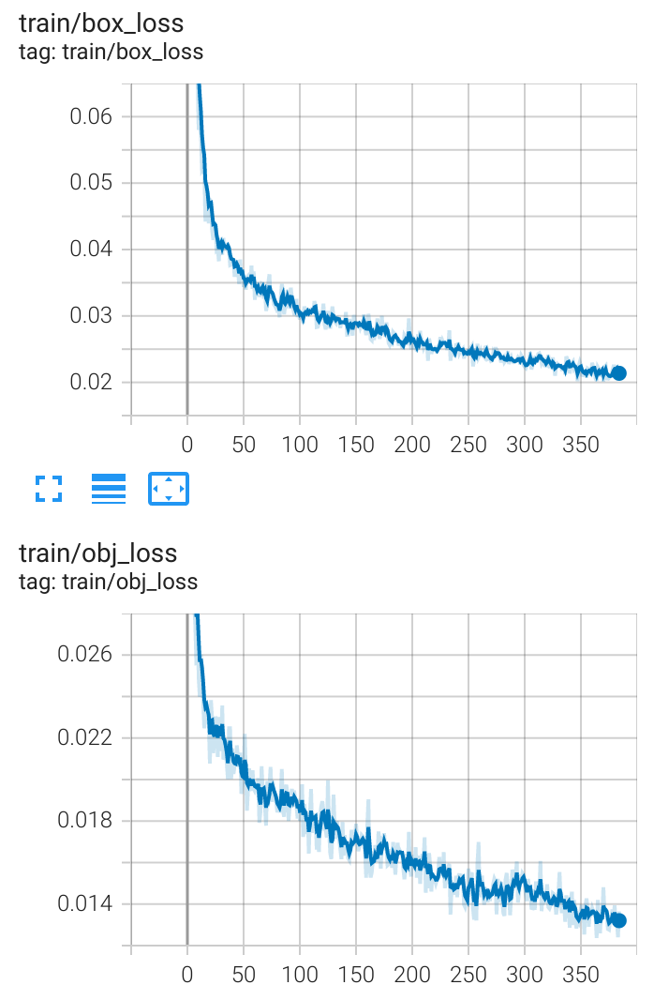

.. _doc_camera_cone_detection:

Camera Cone Detection
========================

The Purdue Grand Prix race track has traffic cones from start to end for the teams to employ camera and LIDAR perception to navigate the track. A camera-based cone detection algorithm was developed to detect the cones and use the location of the cones to aid the Follow The Gap algorithm.

Camera used: Intel Realsense D435 Depth Camera 

The initial task included detecting the cones and drawing bounding boxes around detected cones. A MobileNetV1 model was trained for this purpose. The dataset included images of cones in various shapes, backgrounds and colors. MobileNet's performance was suboptimal as can be seen below. This could be attributed to the scarcity of data or lack of task-specific images.

.. raw:: html

	<iframe width="560" height="315" src="https://www.youtube.com/embed/7DExNPwIYmM" frameborder="0" allow="accelerometer; autoplay; clipboard-write; encrypted-media; gyroscope; picture-in-picture" allowfullscreen></iframe>

Data augmentation was performed combining different cone datasets and creating our own with the cones used at the EV Grand Prix race.
The dataset can be found here in roboflow - `Roboflow trained model and dataset <https://app.roboflow.com/ds/fmZgSOwqOC?key=w4lxpZmcmQ>`_
This is a trained Roboflow 2.0 Object Detection model which can be deployed to NVIDIA Jetson using Roboflow inference API as a docker container 
The following augmentations were carried out on the images as following.

The final cone detection model was then trained on this dataset with a YoloV5 architecture. This provided better results compared to the old dataset & MobilenetV1.

  .. figure:: img/yolo3.png
  :align: center

