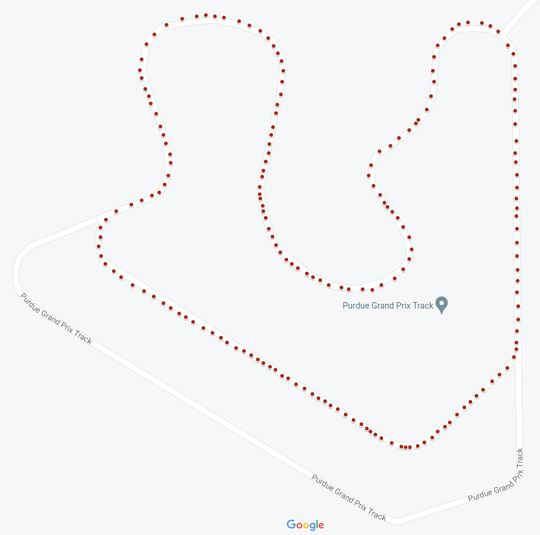
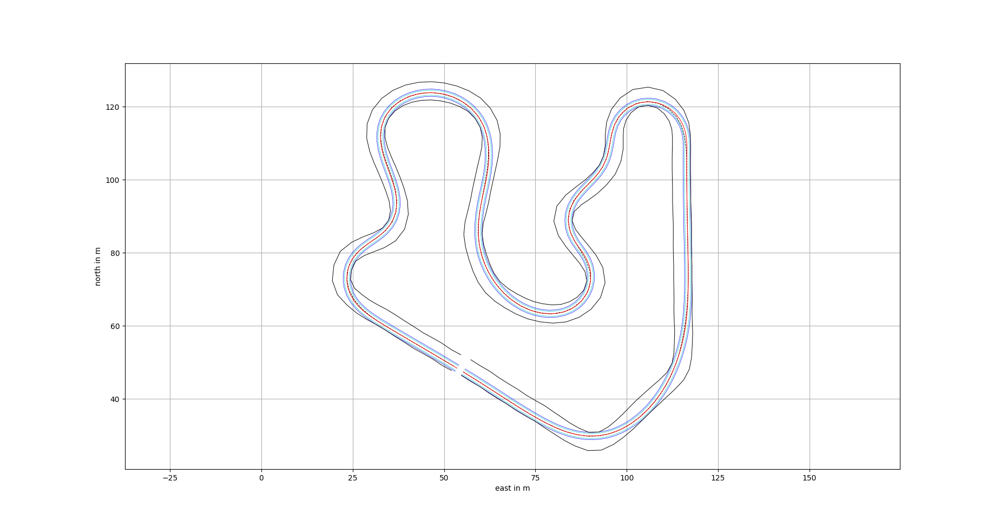

.. _doc_race_line

Race Line Optimization
======================

The `Global raceline optimization <https://github.com/TUMFTM/global_racetrajectory_optimization>`_ repo was used to find the *minimum curve* trajectory. This was calculated offline by plotting GPS points on the go kart track in Purdue.

