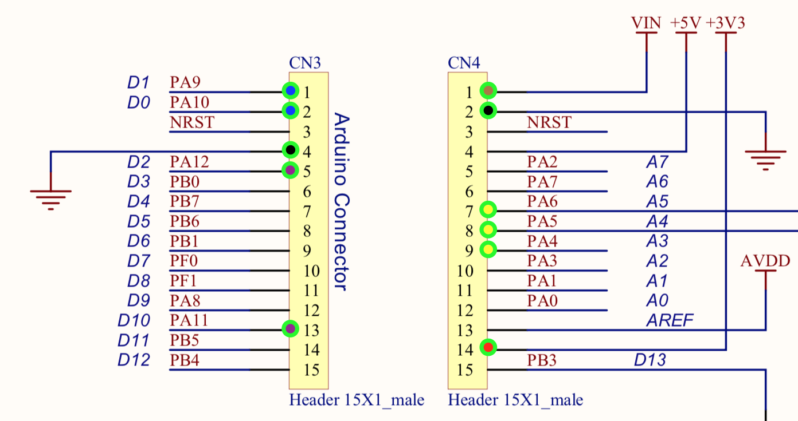

.. _doc_low_level:

Low-Level Components
======================

This section details the various low-level components used on the GoKart to make it autonomous. It list resources for each of these components and a working code repository if possible.

Main Reliable Real-Time Computer (RRTC)
-------------------------------
This system is running on the NUCLEO-F439ZI board with the STM32F439ZIT6 MCU (which is a single-core ARM Cortex M4). More information regarding the system and the implementation libraries used are all available here: `RRTC Github Repo <https://github.com/mlab-upenn/gokart-rtc-hal-f4>`_.

This system is also using a custom PCB which is universal and hand soldered.

The Pinout schematic diagram is as mentioned below:

    * 3V3
    * GND
    * PG3 = CONTACTOR_RELAY (with external pull-down 10K)
    * PD6 = SPEKTRUM_RX
    * PD0 = CAN1_RX
    * PD1 = CAN1_TX
    * PE9 = SPEED_SENSOR_PULSE
    * PA5 = THROTTLE_PWM

.. image:: ../../img/big_n.png
    :align: center

The custom PCB houses the following components:
    * `CAN transreceiver <https://www.amazon.com/dp/B00KM6XMXO?psc=1&ref=ppx_yo2ov_dt_b_product_details>`_
    * `Contactor Relay Circuit <https://www.falstad.com/circuit/circuitjs.html?ctz=CQAgjCAMB0l3BWEBmAHAJmgdgGzoRmACzICcpkORICkNIJNApgLRhgBQASjUdWDhBU6AqGKIj0YujAQcALgyoMiqXtT5qRUaAnLJk6UlmKlUWVKUEwcJhAUhYnOSERxXw6OgBMmAMwBDAFcAG3kOAHN1GnQ1HARBBFjpDgAnJQ1VFCSVLRAvOG4UZESwKQNE3GkGOmRoZGrZDgA3ECwS8DKhCU6pGRqGPJldDjALGir2KQQq9B7BCBg+2AEEnGQECTAKVEgKJBhIJDB4eB1ICCwvc6Ob444Ad2jkV2i5mVG8NtRqdCuQUjJP5SKS+QKheQsEJMbzgRorR4TBZdYS9KCIhJ0d40Fz5f6QDF8NGbfjWQkaZQkmJaDgAZWyUk0DJoXW0gRCAGcmGJ0JEUDg1AguiVBVUPk8qS9qFSSH1RuNcGopm0BfkEkI4UtwNABK5KAZUHhaJB0DhWNtzsdTnBzpdrodbg6Doj2oJ8IJXXi5U8LL9-lgcsD0T7A+qAyD8RwOW0OkHPSKxBB2VyozHBAnPUy2QFOUwXR0mXhMjSJbig0XcsHosrVCJWeT8j1a42PrDm9jm8rQf5gmE+YC1EGB8yPjxFWjx8p+j1WdIRgB7NrdcR7Ug6ZBlA6wfA8pfIDhAA>`_

The RC Radio Controller is also connected to the RRTC so enable teleoperation of the GoKart. More information regarding the communication implementation with the Nucleo can be found here: `Spektrum Rc Repo <https://github.com/mlab-upenn/spektrum-rc>`_

We are also using a `PWM to analog converter <https://www.amazon.com/Converter-Module-Voltage-Adjustable-Digital/dp/B07SZ8CVKD>`_.

The Wheel Speed Sensor Circuit mentioned previously is also available `here <https://www.amazon.com/Motorcycle-Speedometer-Sensor-Digital-Odometer/dp/B08CL1374W/ref=pd_sbs_sccl_3/135-3593178-5971061?pd_rd_w=NVCWd&pf_rd_p=23e9c531-a4f3-4198-b456-2bff73f4055a&pf_rd_r=4T4DQEC71SSFE6DA6KR3&pd_rd_r=18fbfc43-8af5-48ba-9e30-e20a05f4c85a&pd_rd_wg=nF33C&pd_rd_i=B08CL1374W&psc=1>`_

As mentioned all of the implementation libraries for the aforementioned components are linked in the main repository `here <https://github.com/mlab-upenn/gokart-rtc-hal-f4>`_.

The main tasks performed by the RRTC are:
    * Receives control commands from AGX via CAN.
    * Receives current (actual) steering angle from the steering unit via CAN.
    * Reads speed sensor (digital 0-1 similar to square pulse)
    * Receives radio control from Spektrum (UART).
    * Sends odomentry to AGX via CAN.
    * Manages the system state for 1. autonomous v/s manual mode 2. Emergency Brake on v/s off
    * Runs the closed-loop PID for speed or throtle by reading the wheel speed sensor and calculating the power output for the Alltrax Motor Controller.
    * Based on the system state it
        1. Controls the contactors
        2. Changes the PWM throtle output
        3. Sends steering commands to the steering unit via CAN
        4. Sends braking commands (torque control) to the braking VESC via CAN

Steering Control Unit
-----------------------

This control unit is running on the NUCLEO-L432KC board with the STM32L432KCU6 MCU (which is a single-core ARM Cortex M4). All of the code level implementation for this task can be found here: `Steering Unit Repo <https://github.com/mlab-upenn/gokart-rtc-hal-l4>`_

Just like the main RRTC we are also using a custom PCB for this:

The Pinout schematic diagram is as mentioned below:

    * VIN
    * GND
    * 3V3
    * PA12 = CAN1_TX
    * PA11 = CAN1_RX
    * PA9 = UART_VESC_TX
    * PA10 = UART_VESC_RX
    * PA6 = SPI1_MISO
    * PA5 = SPI1_SCK
    * PA4 = SPI1_NSS_MANUAL

It uses a similar CAN transreceiver as the RRTC.

It also uses an Absolute Position Sensor which is connected using an SPI. We had to unsolder a resistor from the board to switch to 3V3 power supply. Also 3V3 and 5V pins on AS5047P should be connected together when using 3V3.
More information regarding the sensor can be found here: `Position Sensor Website <https://www.digikey.com/en/products/detail/ams/AS5047P-TS-EK-AB/5452344?s=N4IgTCBcDaIIIGUCsAGALAdgAogLoF8g>`_

The main tasks of the steering control unit are listed below:
    * Receives steering angle from main RRTC via CAN.
    * Sends the current (actual) steering angle  to the main RRTC via CAN.
    * Runs closed-loop PID for steering angle:
        1. Reads absolute position sensor.
        2. Control the steering motor using torque via Steering VESC which is connected via UART.

Braking VESC
--------------------------

Used for autonomous braking. This has the absolute position sensor connected to it. The sensor used in our case is the AS5047P - hall sensor. The implementation for this sensor can be found in the main code repository mentioned above.

Hence the above mentioned details describes the low-level implementations of our GoKart. All of these components are connected on a unidirectional CAN Bus which also connects the main AGX computing unit.