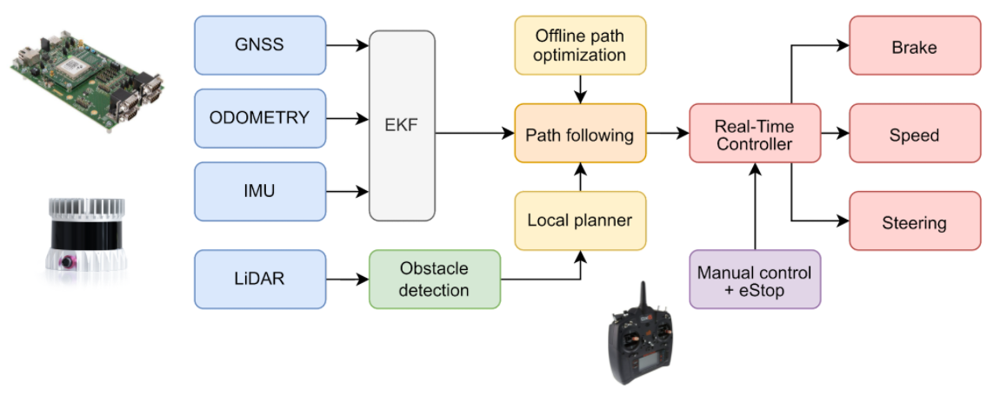

.. _doc_learn_intro:

Learn
======================

This section details the various components, high-level and low-level algorithms used on the GoKart to make it autonomous. It list resources for each high level algorithm and a working code repository if possible.
See the side-bar under "Learn" for more details.

.. toctree::
    :maxdepth: 1
    :caption: Learn
    :name: sec-learn
    :hidden:

    Software/intro
    Hardware/intro
    
